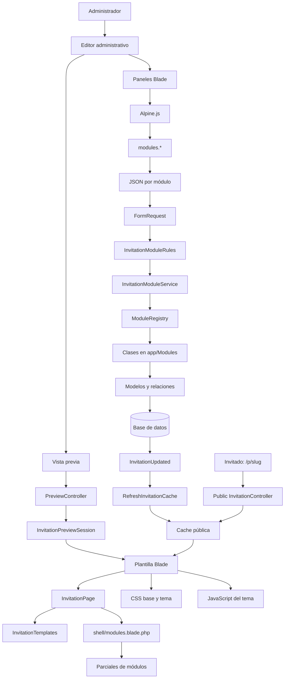
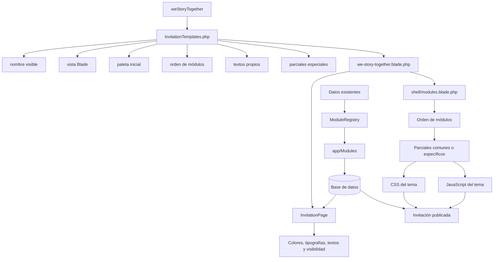

# Guía de generación de plantillas

## Contenido de este archivo

Esta guía explica cómo se construyen las invitaciones y cartas desde el panel administrativo
de **Bida Events**, qué entradas puede proporcionar el administrador, cómo se almacenan y cómo
se transforman en una invitación pública.

Al leerla encontrarás:

1. Una tabla completa de las entradas disponibles desde la interfaz administrativa, incluyendo
   su tipo y uso general.
2. El flujo de datos desde el editor hasta la base de datos y la vista pública.
3. Un diagrama de las carpetas y archivos que participan en el diseño de una plantilla.
4. La función de `EventProfiles`, `InvitationTemplates`, `InvitationPage`, módulos, parciales,
   CSS y JavaScript.
5. Una guía concreta para crear la plantilla `weStoryTogether`.
6. La diferencia entre crear solamente un nuevo diseño y crear un nuevo producto con datos o
   módulos propios.

La regla principal es:

> Si `weStoryTogether` reutiliza los datos actuales, se deben modificar principalmente el
> catálogo de plantillas, la vista Blade, los parciales específicos, el CSS y, si hace falta,
> el JavaScript. Si necesita datos nuevos, también deben incorporarse un perfil, módulos,
> modelos, migraciones, paneles y reglas de validación.

---

## 1. Entradas disponibles desde la interfaz administrativa

La tabla reúne los datos que el administrador puede introducir o modificar desde el editor de
invitaciones y desde la gestión de invitados.

| Área | Entrada / ruta del dato | Tipo | Uso general |
|---|---|---|---|
| General | `title` | Texto | Nombre principal de la invitación. |
| General | `slug` | Texto | Identificador de la URL pública. |
| General | `template` | Selector | Define la plantilla visual que se utilizará. |
| General | `event_type_id` | Selector | Tipo de evento: XV años, boda, bautizo, cumpleaños o tarjeta. |
| General | `user_id` | Selector | Cliente propietario de la invitación. |
| General | `event_date` | Fecha y hora | Fecha y hora real del evento. |
| General | `expires_at` | Fecha | Fecha hasta la que la invitación permanece disponible. |
| General | `status` | Selector | Estado de la invitación: activa o inactiva. |
| Cliente | `name` | Texto | Nombre de un nuevo cliente creado desde el editor. |
| Portada | `modules.bienvenida.nombre` | Texto | Nombre principal mostrado en la portada. |
| Portada | `modules.bienvenida.nombre_pareja` | Texto | Segundo nombre, principalmente usado en bodas. |
| Portada | `modules.bienvenida.nombre_quinceanera` | Texto | Nombre completo compatible con XV años u otros formatos. |
| Portada | `modules.bienvenida.edad` | Número | Edad que se mostrará en cumpleaños o XV años. |
| Portada | `modules.bienvenida.subtitulo` | Texto | Frase corta debajo del nombre principal. |
| Portada | `modules.bienvenida.mensaje` | Área de texto | Mensaje principal para los invitados. |
| Portada | `modules.bienvenida.fecha_texto` | Texto | Fecha escrita visualmente, independiente de la fecha técnica. |
| Portada | `modules.bienvenida.imagen_hero` | Imagen / URL | Fotografía principal de la portada. |
| Portada | `modules.bienvenida.imagen_hero_alt` | Texto | Descripción accesible de la fotografía principal. |
| Portada | `modules.bienvenida.mensaje_post_evento` | Área de texto | Agradecimiento mostrado después del evento. |
| Estética | `modules.config.colores.primary` | Selector de color | Color primario de la plantilla. |
| Estética | `modules.config.colores.secondary` | Selector de color | Color secundario de la plantilla. |
| Estética | `modules.config.colores.accent` | Selector de color | Color de acento para detalles y decoraciones. |
| Estética | `modules.config.colores.text` | Selector de color | Color principal del texto. |
| Estética | `modules.config.colores.background` | Selector de color | Color de fondo general. |
| Estética | `modules.config.tipografias.titulos` | Selector | Tipografía de títulos. |
| Estética | `modules.config.tipografias.cuerpo` | Selector | Tipografía de textos generales. |
| Estética | `modules.config.tipografias.script` | Selector | Tipografía manuscrita o decorativa. |
| Visibilidad | `modules.config.modulos.cuenta_regresiva` | Interruptor | Activa o desactiva la cuenta regresiva. |
| Visibilidad | `modules.config.modulos.agendar` | Interruptor | Muestra la opción de guardar el evento en Google Calendar. |
| Visibilidad | `modules.config.modulos.fotomural` | Interruptor | Activa o desactiva el fotomural. |
| Visibilidad | `modules.config.modulos.regalos` | Interruptor | Activa o desactiva la sección de regalos. |
| Visibilidad | `modules.config.modulos.post_evento` | Interruptor | Activa o desactiva la sección posterior al evento. |
| Ubicación | `modules.ubicacion.nombre_lugar` | Texto | Nombre del salón, iglesia, restaurante o lugar. |
| Ubicación | `modules.ubicacion.direccion` | Texto | Dirección física del evento. |
| Ubicación | `modules.ubicacion.lat` | Número decimal | Latitud utilizada para el mapa. |
| Ubicación | `modules.ubicacion.lng` | Número decimal | Longitud utilizada para el mapa. |
| Ubicación | `modules.ubicacion.maps_url` | URL | Enlace a Google Maps u otro mapa. |
| Ubicación | `modules.ubicacion.nota` | Área de texto | Indicaciones adicionales para llegar. |
| Ubicación | `modules.ubicacion.imagen_lugar` | Imagen / URL | Imagen del lugar del evento. |
| Itinerario | `modules.itinerario.titulo` | Texto | Título de la sección del itinerario. |
| Itinerario | `modules.itinerario.eventos[].hora` | Texto / hora | Hora de cada actividad. |
| Itinerario | `modules.itinerario.eventos[].titulo` | Texto | Nombre de la actividad. |
| Itinerario | `modules.itinerario.eventos[].descripcion` | Área de texto | Explicación de la actividad. |
| Itinerario | `modules.itinerario.eventos[].icono` | Selector | Ícono visual de cada momento. |
| Vestimenta | `modules.dress_code.titulo` | Texto | Título del código de vestimenta. |
| Vestimenta | `modules.dress_code.estilo` | Texto | Estilo general solicitado. |
| Vestimenta | `modules.dress_code.descripcion` | Área de texto | Explicación del código de vestimenta. |
| Vestimenta | `modules.dress_code.sugerencias[].para` | Texto | Grupo al que aplica la sugerencia. |
| Vestimenta | `modules.dress_code.sugerencias[].titulo` | Texto | Nombre de la sugerencia. |
| Vestimenta | `modules.dress_code.sugerencias[].descripcion` | Área de texto | Detalle de la sugerencia. |
| Vestimenta | `modules.dress_code.sugerencias[].imagen` | Imagen / URL | Imagen de referencia. |
| Vestimenta | `modules.dress_code.colores_permitidos[]` | Color y texto | Colores recomendados o permitidos. |
| Vestimenta | `modules.dress_code.evitar[]` | Texto | Prendas, colores o estilos que se deben evitar. |
| Personas destacadas | `modules.destacados.chambelanes[]` | Lista | Personas que forman parte de los chambelanes. |
| Personas destacadas | `modules.destacados.damitas[]` | Lista | Personas que forman parte de las damitas. |
| Personas destacadas | `modules.destacados.padrinos[]` | Lista | Padrinos u otras personas destacadas. |
| Personas destacadas | Campos de cada persona | Texto | Nombre, detalle, rol y mensaje opcional. |
| Galería | `modules.galeria.titulo` | Texto | Título de la galería. |
| Galería | `modules.galeria.fotos[]` | Lista de imágenes | Fotografías mostradas en la invitación. |
| Galería | `modules.galeria.fotos[].url` | URL | Dirección de la fotografía, normalmente de Cloudinary. |
| Galería | `modules.galeria.fotos[].alt` | Texto | Texto alternativo de cada fotografía. |
| Video | `modules.video.video_url` | URL | Enlace del video. |
| Video | `modules.video.poster` | Imagen / URL | Imagen previa del video. |
| Música | `modules.musica.titulo` | Texto | Nombre de la canción o audio. |
| Música | `modules.musica.artista` | Texto | Artista o intérprete. |
| Música | `modules.musica.audio_url` | URL / archivo | Archivo o URL del audio. |
| Música | `modules.musica.autoplay` | Interruptor | Define si el audio intenta iniciar automáticamente. |
| Playlist | `modules.playlist.titulo` | Texto | Título de la sección de canciones. |
| Playlist | `modules.playlist.descripcion` | Área de texto | Instrucciones para sugerir canciones. |
| Playlist | `modules.playlist.placeholder` | Texto | Ayuda del campo de sugerencias. |
| Hashtag | `modules.hashtag.hashtag` | Texto | Hashtag oficial del evento. |
| Hashtag | `modules.hashtag.texto_boton` | Texto | Texto del botón o llamada a la acción. |
| Encuestas | `modules.encuestas.titulo` | Texto | Título general de las encuestas. |
| Encuestas | `modules.encuestas.preguntas[].id` | Texto | Identificador interno de la encuesta. |
| Encuestas | `modules.encuestas.preguntas[].tipo` | Selector | Tipo: opción única, valoración, sí/no o emoji. |
| Encuestas | `modules.encuestas.preguntas[].pregunta` | Texto | Pregunta para los invitados. |
| Encuestas | `modules.encuestas.preguntas[].opciones[]` | Texto | Opciones disponibles para votar. |
| Regalos | `modules.regalos.titulo` | Texto | Título de la sección de regalos. |
| Regalos | `modules.regalos.tienda_url` | URL | Enlace a tienda o lista de regalos. |
| Regalos | `modules.regalos.tienda_texto` | Texto | Texto visible del enlace. |
| Regalos | `modules.regalos.sobres.titulo` | Texto | Título para regalos físicos o sobres. |
| Regalos | `modules.regalos.sobres.direccion` | Texto | Dirección para entregar regalos físicos. |
| Regalos | `modules.regalos.banco.banco` | Texto | Nombre del banco. |
| Regalos | `modules.regalos.banco.titular` | Texto | Titular de la cuenta. |
| Regalos | `modules.regalos.banco.ci` | Texto | Documento o CI del titular. |
| Regalos | `modules.regalos.banco.cuenta` | Texto | Número de cuenta. |
| Regalos | `modules.regalos.banco.qr_url` | Imagen / URL | QR para transferencia bancaria. |
| Regalos | `modules.regalos.opciones[]` | Lista | Opciones individuales de regalo. |
| Regalos | Campos de cada opción | Texto, área o URL | Título, descripción, enlace e imagen. |
| RSVP | Configuración de RSVP | Interruptor y textos | Define si se solicita confirmación de asistencia. |
| Post-evento | `modules.post_evento.titulo` | Texto | Título de la galería posterior. |
| Post-evento | `modules.post_evento.descripcion` | Área de texto | Descripción de las fotografías posteriores. |
| Post-evento | `modules.post_evento.fotos[]` | Lista de imágenes | Fotografías oficiales posteriores. |
| Post-evento | `modules.post_evento.fotos[].alt` | Texto | Texto alternativo de cada fotografía. |
| Post-evento | `modules.post_evento.enlace_externo` | URL | Enlace a Google Drive, Dropbox u otra galería. |
| Carta | `modules.dedicatoria.de` | Texto | Persona que envía la carta. |
| Carta | `modules.dedicatoria.para` | Texto | Persona que recibe la carta. |
| Carta | `modules.dedicatoria.mensaje` | Área de texto | Mensaje principal de la carta. |
| Carta | `modules.dedicatoria.firma` | Texto | Firma de quien envía la carta. |
| Carta | `modules.juntos_desde.titulo` | Texto | Título del contador de relación. |
| Carta | `modules.juntos_desde.fecha` | Fecha | Fecha desde la que están juntos. |
| Carta | `modules.respuesta.titulo` | Texto | Título de la sección de respuesta. |
| Carta | `modules.respuesta.descripcion` | Área de texto | Explicación para quien recibe la carta. |
| Carta | `modules.respuesta.placeholder` | Texto | Ayuda del campo de respuesta. |
| Invitados | `name` | Texto | Nombre del invitado o grupo familiar. |
| Invitados | `phone` | Teléfono | Número de contacto del invitado. |
| Invitados | `passes_allocated` | Número | Cantidad de pases asignados. |
| Invitados | `estado` | Selector de filtro | Filtro administrativo por estado de confirmación. |
| Invitados | `q` | Texto de búsqueda | Búsqueda de invitados por nombre. |

Las entradas del editor se concentran en
[`resources/views/admin/invitations/panels/`](resources/views/admin/invitations/panels) y
[`resources/views/admin/invitations/_form.blade.php`](resources/views/admin/invitations/_form.blade.php).
La gestión de invitados está en
[`resources/views/admin/guests/index.blade.php`](resources/views/admin/guests/index.blade.php).

---

## 2. Flujo general de datos



### Secuencia

1. El administrador abre el editor en `/admin/invitations/create` o `/admin/invitations/{id}/edit`.
2. Los paneles Blade muestran inputs enlazados con Alpine.js.
3. Alpine.js mantiene los datos en `modules.*` y serializa cada módulo como JSON.
4. `StoreInvitationRequest` o `UpdateInvitationRequest` valida los datos generales.
5. `ValidatesInvitationModules` decodifica los módulos.
6. `InvitationModuleRules` valida estructura, tamaños, fechas, URLs y listas.
7. `InvitationModuleService` normaliza los módulos y abre una transacción.
8. `ModuleRegistry` llama al `save()` de cada módulo.
9. Cada módulo guarda sus propios datos mediante modelos y relaciones.
10. `InvitationUpdated` invalida y recalienta la caché.
11. La vista previa usa la sesión y no guarda definitivamente los cambios.
12. La ruta pública carga los módulos, resuelve la plantilla y renderiza la invitación.

---

## 3. Carpetas y responsabilidades

### `app/EventProfiles`

Define el comportamiento de un tipo de evento o producto para el editor:

- Nombre y código estable.
- Módulos disponibles.
- Módulos activos por defecto.
- Campos obligatorios.
- Campos de portada.
- Grupos de personas destacadas.
- Textos de ejemplo.

Archivos relevantes:

- [`EventProfile.php`](app/EventProfiles/EventProfile.php)
- [`EventProfiles.php`](app/EventProfiles/EventProfiles.php)
- [`XvProfile.php`](app/EventProfiles/XvProfile.php)
- [`WeddingProfile.php`](app/EventProfiles/WeddingProfile.php)
- [`BaptismProfile.php`](app/EventProfiles/BaptismProfile.php)
- [`BirthdayProfile.php`](app/EventProfiles/BirthdayProfile.php)
- [`LoveCardProfile.php`](app/EventProfiles/LoveCardProfile.php)
- [`config/event_profiles.php`](config/event_profiles.php)

Un perfil nuevo solo es necesario si `weStoryTogether` será un tipo de producto o evento con
vocabulario, campos requeridos o módulos diferentes.

### `app/Support/InvitationTemplates.php`

Es el catálogo central de plantillas. Define:

- Constante y vista de la plantilla.
- Nombre y descripción.
- Tipo de evento asociado.
- Paleta inicial.
- Orden de módulos.
- Textos propios.
- Parciales especiales.
- Reacciones especiales.

Es el primer archivo que debe modificarse para registrar `weStoryTogether`.

### `resources/views/invitations/templates`

Contiene la vista completa de cada plantilla. Para la nueva plantilla se recomienda crear:

```text
resources/views/invitations/templates/we-story-together.blade.php
```

La vista debe crear `InvitationPage` y reutilizar, cuando sea posible, los componentes `shell`:

```blade
@include('invitations.partials.shell.head')
@include('invitations.partials.shell.nav')
@include('invitations.partials.shell.modules')
@include('invitations.partials.shell.footer')
@include('invitations.partials.shell.scripts')
```

### `resources/views/invitations/partials`

Contiene los módulos visuales reutilizables:

- `hero.blade.php`
- `location.blade.php`
- `itinerary.blade.php`
- `gallery-stack.blade.php`
- `dress-code.blade.php`
- `destacados.blade.php`
- `video.blade.php`
- `polls.blade.php`
- `playlist.blade.php`
- `regalos.blade.php`
- `rsvp.blade.php`
- `fotomural.blade.php`
- `post-event.blade.php`

Si `weStoryTogether` necesita una presentación distinta para un módulo, se debe crear un parcial
específico, por ejemplo:

```text
resources/views/invitations/partials/we-story-together/hero.blade.php
```

Luego se registra en la clave `partials` de `InvitationTemplates.php`.

### `resources/views/invitations/partials/shell`

Contiene la estructura compartida:

- `head.blade.php`: metadatos, fuentes, Vite y variables CSS.
- `nav.blade.php`: navegación.
- `modules.blade.php`: recorre el orden y renderiza módulos.
- `footer.blade.php`: pie de página.
- `scripts.blade.php`: scripts comunes.

La nueva plantilla debería reutilizar estos archivos. No conviene modificarlos para resolver una
necesidad exclusiva de `weStoryTogether`.

### `app/Support/InvitationPage.php`

Adapta los datos a la vista:

- Colores y tipografías.
- Textos de la plantilla.
- Módulos visibles.
- Orden de las secciones.
- Nombre, fecha y lugar.
- Estado posterior al evento.
- Parciales especiales.
- Elementos de navegación.

Normalmente no hay que modificar este archivo para agregar una plantilla; la configuración nueva
debe declararse en `InvitationTemplates.php`.

### `app/Modules`

Implementa la modularización funcional. Algunos módulos son:

- `ConfigModule`: colores, tipografías y visibilidad.
- `HeroModule`: portada.
- `LocationModule`: ubicación.
- `ItineraryModule`: itinerario.
- `GalleryModule`: galería.
- `DressCodeModule`: vestimenta.
- `FeaturedPeopleModule`: personas destacadas.
- `GiftsModule`: regalos.
- `PollsModule`: encuestas.
- `RsvpModule`: confirmación.
- `AudioModule`: música.
- `VideoModule`: video.
- `PlaylistModule`: playlist.
- `PostEventModule`: contenido posterior.
- `ToggleModule`: módulos activables.

El registro central es:

- [`config/modules.php`](config/modules.php)
- [`ModuleRegistry.php`](app/Modules/ModuleRegistry.php)

Si `weStoryTogether` usa los mismos datos, no se deben crear módulos nuevos. Si requiere
información que no existe, se debe crear un módulo con su `defaults()`, `load()`, `save()`,
validaciones, panel y vista pública.

### `app/Models` y `database/migrations`

Representan el almacenamiento permanente. No deben modificarse para una plantilla que solo cambia
la presentación. Solo se necesitan cuando se agregan datos nuevos que no pueden representarse con
los módulos existentes.

### `resources/css/invitation`

Contiene los estilos compartidos. Para una identidad visual independiente se recomienda crear:

```text
resources/css/invitation/themes/we-story-together.css
```

La plantilla debe aplicar una clase propia al `body`, por ejemplo:

```html
<body class="inv-page inv-we-story-together">
```

### `resources/js`

Solo requiere archivos nuevos si la plantilla tiene interacciones propias:

- Navegación por escenas.
- Capítulos.
- Gestos táctiles.
- Animaciones de scroll.
- Progreso de lectura.
- Apertura o transición especial.

Una ubicación posible es:

```text
resources/js/story/we-story-together.js
```

---

## 4. Guía específica para `weStoryTogether`

### Caso recomendado: nueva apariencia con módulos existentes

Archivos que se deben crear o modificar:

```text
1. app/Support/InvitationTemplates.php
   Registrar la plantilla, su paleta, orden, textos y parciales especiales.

2. resources/views/invitations/templates/we-story-together.blade.php
   Crear la composición HTML y reutilizar los módulos existentes.

3. resources/css/invitation/themes/we-story-together.css
   Crear colores, tipografías, formas, animaciones y diseño del tema.

4. resources/views/invitations/partials/we-story-together/
   Crear solo los parciales que no puedan reutilizarse.

5. resources/js/story/we-story-together.js
   Crear solo si existen interacciones nuevas.
```

En este caso no es necesario modificar:

```text
app/Models/
database/migrations/
app/Modules/
```

### Caso ampliado: nuevo producto con datos propios

Si `weStoryTogether` requiere información nueva, el trabajo adicional será:

```text
1. app/EventProfiles/WeStoryTogetherProfile.php
2. config/event_profiles.php
3. app/Modules/Invitation/StoryModule.php o módulos equivalentes
4. config/modules.php
5. resources/views/admin/invitations/panels/story.blade.php
6. app/Models/InvitationStory.php
7. database/migrations/*_create_invitation_stories_table.php
8. resources/views/invitations/partials/we-story-together/story.blade.php
9. resources/css/invitation/themes/we-story-together.css
10. resources/js/story/we-story-together.js, si corresponde
```

El módulo nuevo debe integrarse al flujo existente, no guardar directamente desde la plantilla.

---

## 5. Flujo de unificación de `weStoryTogether`



La responsabilidad de cada parte es:

| Parte | Qué se desarrolla |
|---|---|
| `InvitationTemplates.php` | Registro y configuración declarativa de la plantilla. |
| Vista principal | Estructura de la página, portada, navegación, módulos y footer. |
| `InvitationPage` | Adaptación de datos, visibilidad y orden; normalmente se reutiliza. |
| `shell/modules.blade.php` | Unificación del orden y renderizado; normalmente se reutiliza. |
| Parciales | Presentación concreta de cada sección. |
| CSS | Identidad visual, responsive, colores, tipografía y animaciones visuales. |
| JavaScript | Interacciones y comportamiento exclusivo de la plantilla. |
| EventProfile | Solo si cambian el producto, el vocabulario o los requisitos del editor. |
| Modules | Solo si aparecen datos funcionales nuevos. |
| Models y migrations | Solo si esos datos nuevos necesitan persistencia propia. |

---

## 6. Checklist de implementación

### Si solo cambia el diseño

- [ ] Agregar la constante y configuración en `InvitationTemplates.php`.
- [ ] Crear `we-story-together.blade.php`.
- [ ] Definir el orden de módulos.
- [ ] Reutilizar `InvitationPage` y `shell/modules`.
- [ ] Crear parciales específicos únicamente cuando sea necesario.
- [ ] Crear el CSS propio del tema.
- [ ] Cargar JavaScript propio solo si hay interacciones nuevas.
- [ ] Comprobar la vista previa del editor.
- [ ] Comprobar la ruta pública general.
- [ ] Comprobar la ruta pública personalizada con token.
- [ ] Verificar módulos visibles y ocultos.
- [ ] Verificar comportamiento responsive.

### Si también cambia el modelo de datos

- [ ] Crear o actualizar el `EventProfile`.
- [ ] Registrar el perfil en `config/event_profiles.php`.
- [ ] Crear el módulo funcional.
- [ ] Registrar el módulo en `config/modules.php`.
- [ ] Crear el panel administrativo.
- [ ] Agregar reglas de validación.
- [ ] Crear modelo y migración.
- [ ] Crear el parcial público.
- [ ] Actualizar el CSS y JavaScript.
- [ ] Probar guardado, edición, vista previa y publicación.

---

## 7. Regla de diseño para evitar cambios innecesarios

Antes de crear archivos nuevos, responder:

1. ¿El dato que necesita `weStoryTogether` ya existe en algún módulo?
2. ¿La diferencia es solamente visual?
3. ¿El módulo común puede recibir el dato actual sin cambios?
4. ¿El orden de módulos y los textos pueden declararse en `InvitationTemplates.php`?
5. ¿El comportamiento nuevo pertenece realmente al tema o debería ser un módulo reutilizable?

Si la respuesta es que los datos ya existen y solo cambia la experiencia visual, la implementación
debe mantenerse dentro de:

```text
app/Support/InvitationTemplates.php
resources/views/invitations/templates/
resources/views/invitations/partials/
resources/css/invitation/
resources/js/
```

Esto conserva la modularización existente y evita duplicar validaciones, modelos, migraciones y
paneles administrativos.
